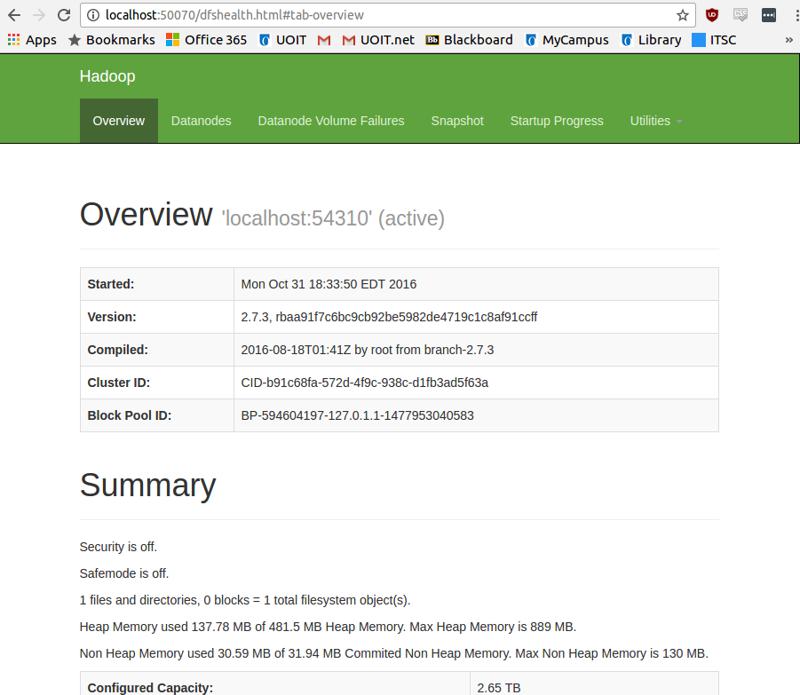

# py-hive
A demo of the python libraries for the Hive MapReduce architecture.

- [Hadoop Install](hadoop-install)

# Hadoop Install

### Java 7 Installation
- Enter these commands in terminal
```
sudo add-apt-repository ppa:webupd8team/java
sudo apt-get update
sudo apt-get install oracle-jdk7-installer
```

### Create Hadoop User
- Create the user
```
sudo addgroup hadoop
sudo adduser --ingroup hadoop hduser
password: hadoop
```

- Switch to the hduser
```
su hduser
password: hadoop
```

- Create ssh key and add it as an authorized key
```
ssh-keygen  -t rsa -P ""
cp ~/.ssh/id_rsa.pub ~/.ssh/authorized_keys
```

- Install ssh and connect to localhost
```
sudo apt-get install ssh
ssh localhost
```

- Exit from the hduser and download the hadoop files into a folder. Extract the files and put them into the usr local files.
```
exit
wget http://apache.mirror.gtcomm.net/hadoop/common/hadoop-2.7.3/hadoop-2.7.3.tar.gz
sudo tar xvzf hadoop-2.7.3.tar.gz
sudo mv hadoop-2.7.3 /usr/local/hadoop
```

- Change the owner of the hadoop files in `usr/local/hadoop` to the hduser
```
cd /usr/local/
sudo chown -R hduser:hadoop hadoop
```

- Edit the bash rc file as hduser
```
su hduser
nano ~/.bashrc
```

- Add this to the file. Remember that ctrl+shft+v is how to paste in terminal.
```bash
  # Environment variable for Hadoop location, include bin in the path
  export HADOOP_HOME=/usr/local/hadoop
  export PATH=$PATH:$HADOOP_HOME/bin

  # Environment varibale for Java location
  export JAVA_HOME=/usr/lib/jvm/java-7-oracle

  # Hadoop related aliases
  unalias fs &> /dev/null
  alias fs="hadoop fs"
  unalias hls &> /dev/null
  alias hls="fs -ls"
```

- You need to reload bash from the change rc file.
```
source ~/.bashrc
```

- Switch back to the main user, make a hadoop app directory and switch back to the hduser.
```
exit
sudo mkdir -p /app/hadoop/tmp
sudo chown -R hduser:hadoop /app/hadoop/tmp
su hduser
```

- Edit the core site xml file
```
nano /usr/local/hadoop/etc/hadoop/core-site.xml
```

- In the configuration tags, insert this

```xml
<property>
  <name>hadoop.tmp.dir</name>
  <value>/app/hadoop/tmp</value>
        <description>A base for other temporary directories.</description>
  </property>


  <property>
  <name>fs.default.name</name>
  <value>hdfs://localhost:54310</value>
  <description>The name of the default file system.  A URI whose
  scheme and authority determine the FileSystem implementation.
  The uri's scheme determines the config property (fs.SCHEME.impl)
  naming the FileSystem implementation class. The uri's authority
  is used to determine the host, port, etc. for a filesystem.</description>
</property>
```

- Edit the mapred-site xml file
```
nano /usr/local/hadoop/etc/hadoop/mapred-site.xml.template
```

- In the configuration tags, add this

```xml
<property>
<name>mapred.job.tracker</name>
<value>localhost:54311</value>
<description>The host and port that the MapReduce job tracker runs
at. If "local", then jobs are run in-process as a single map and reduce task.
</description>
</property>
```

- Edit the hdfs xml file
```
nano /usr/local/hadoop/etc/hadoop/hdfs-site.xml
```

- Put this in the configuration tags

```xml
<property>
<name>dfs.replication</name>
<value>1</value>
<description>Default block replication. The actual number of replications
can be specified when the file is created. The default is used if replication
is not specified in create time.</description>
</property>
```

- Edit the hadoop environment file to add the location of the java JDK
```
nano /usr/local/hadoop/etc/hadoop/hadoop-env.sh
```

- Add this at the end of the file.
```
export JAVA_HOME=/usr/lib/jvm/java-7-oracle
```

- Format the hadoop file system
```
hdfs namenode -format
```

### Start Hadoop Cluster

- Run this command to start the cluster and get the local address.
- Make sure you execute this as hduser
```
su hduser
/usr/local/hadoop/sbin/start-dfs.sh
```

- you can get summaries of the nodes running with the `jps` command

- You should get this at `localhost:50070`



- In order to stop, run this command

```
/usr/local/hadoop/sbin/stop-dfs.sh
```
